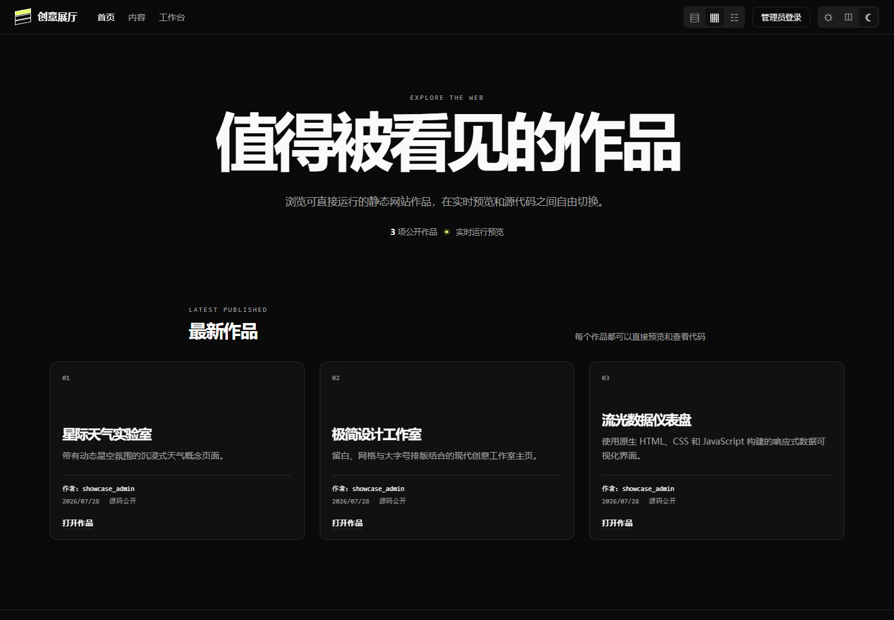
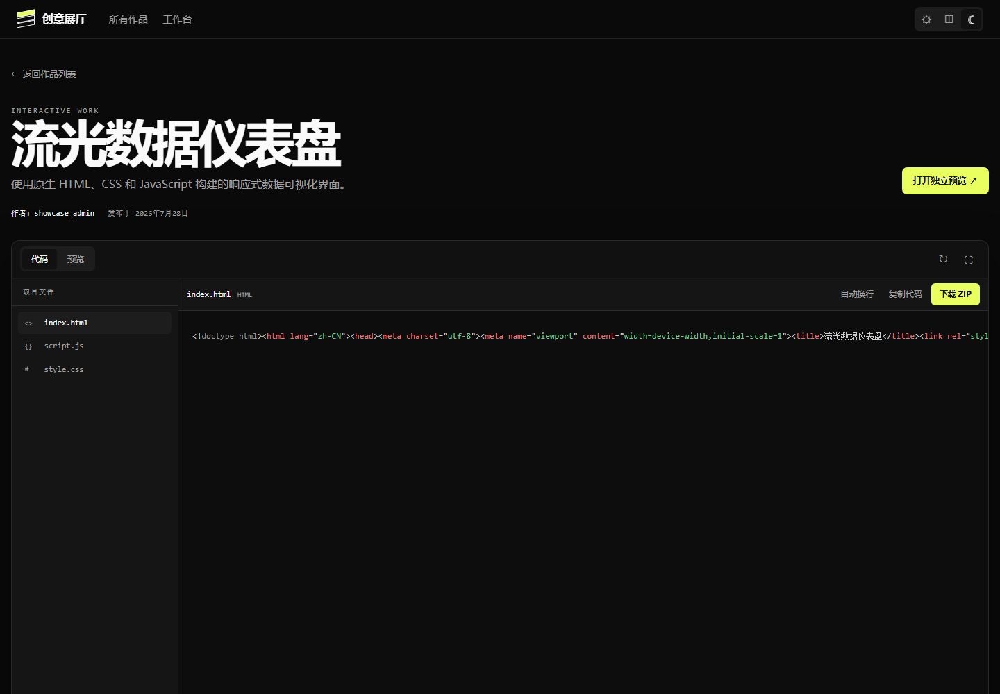
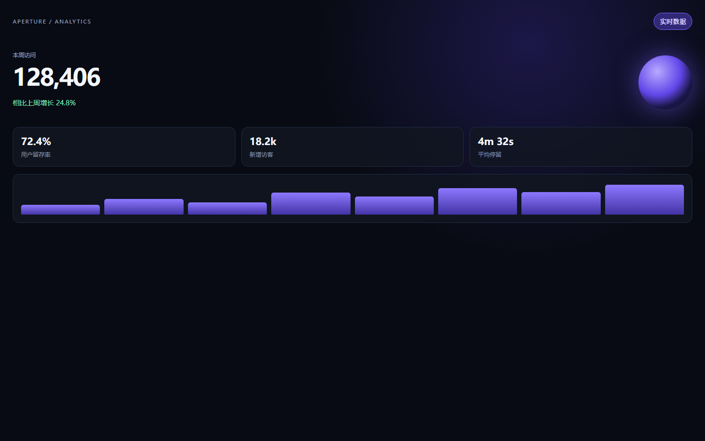
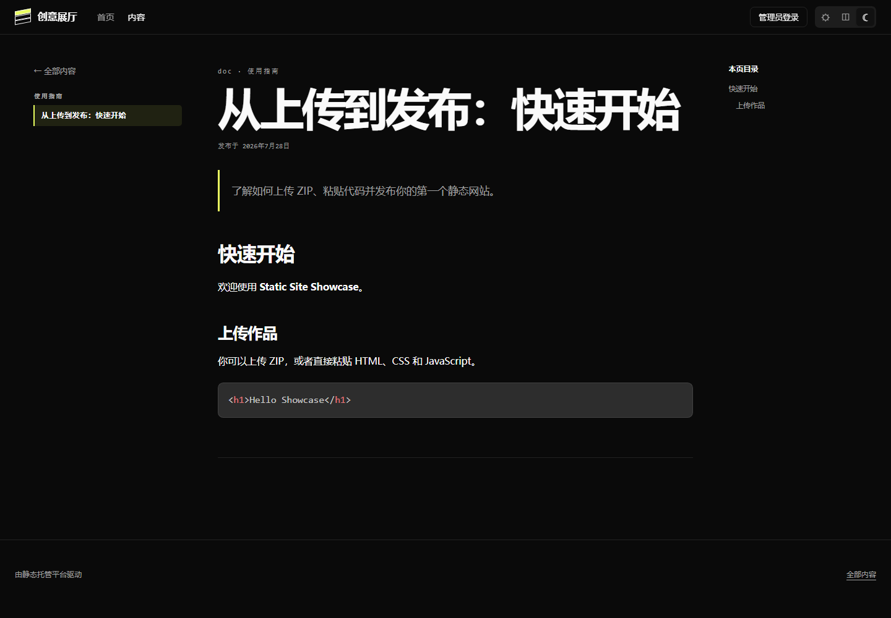

# Static Site Showcase

[](https://github.com/epiphany131/static-site-showcase/actions/workflows/test.yml)
[](https://nodejs.org/)
[](DOCKER.md)
[](LICENSE)

一个可自行部署的静态网站作品展示与托管平台。支持上传 ZIP 项目或直接粘贴 HTML、CSS、JavaScript，一键生成可预览、可发布、可浏览源码和下载源码的静态网站。

平台基于 **Node.js 22、Express 和 SQLite** 构建，不依赖外部数据库服务，同时提供多用户权限、Markdown 内容页面、站点沙箱隔离、Docker Compose 与 Caddy HTTPS 部署方案。

## 界面预览

### 作品展示首页

支持大卡片、网格和紧凑列表布局，并提供浅色、深色与跟随系统三种主题。



### 源码浏览与下载

公开源码的作品可以在线浏览文件树、查看语法高亮代码、复制内容，并直接下载完整 ZIP。



### 静态网站独立预览

每个作品都拥有独立运行地址，上传的 HTML、CSS 和 JavaScript 会在 CSP 沙箱中实时运行。



### Markdown 内容页面

管理员可以创建带分类、目录、代码高亮和前后篇导航的文章、文档及代码教程。



> 以上截图使用隔离演示数据生成，不包含真实账号、用户上传内容或生产环境数据。

## 功能亮点

### 静态网站发布

- 上传包含 `index.html` 的 ZIP 项目并自动解压部署。
- 直接在后台粘贴 HTML、CSS、JavaScript 创建网站。
- 新建作品默认保存为草稿，确认预览效果后再公开发布。
- 可独立控制作品是否公开源代码。
- 公开源码支持在线文件树浏览、语法高亮和 ZIP 下载。
- 自动识别并展开只包含一个项目目录的 ZIP 包。

### 内容与展示

- 提供作品首页、作品详情页和独立内容页。
- 支持创建多篇 Markdown 文章、文档和代码教程。
- Markdown 编辑器提供实时预览、标题目录和代码高亮。
- 支持站点名称、首页文案、主题、布局、Logo 和 Favicon 配置。
- 作品卡片和详情页显示作者用户名。

### 用户与权限

- **管理员**：管理所有作品、内容页面、用户和站点外观。
- **编辑者**：创建并管理自己名下的作品。
- 管理员和编辑者都可以在账号设置中修改自己的用户名和密码。
- 使用 SQLite 会话、HttpOnly Cookie、登录 CSRF 挑战和写操作 CSRF Token。

### 安全设计

- ZIP 路径穿越、文件数量、单文件大小、解压总量和压缩比限制。
- 粘贴代码上传采用严格的 multipart 字段、文件、部件和 UTF-8 校验。
- 托管网站统一运行在不包含 `allow-same-origin` 的 CSP 沙箱中。
- 公开源码自动过滤环境文件、私钥、数据库等敏感内容。
- 登录不依赖固定 Host 白名单，可在本地地址和反向代理后正常使用。
- 不启用带凭据的跨域访问（CORS）。
- 新数据库首次启动时必须显式设置管理员密码，不提供公开默认密码。

## 界面入口

本地启动后可访问：

| 页面 | 地址 |
| --- | --- |
| 作品首页 | <http://localhost:3000/> |
| 内容页面 | <http://localhost:3000/pages> |
| 登录页面 | <http://localhost:3000/login> |
| 管理后台 | <http://localhost:3000/admin/> |
| 健康检查 | <http://localhost:3000/health> |

## 环境要求

- Node.js 22.13.0 或更高版本
- npm
- Docker Engine 和 Docker Compose v2（使用容器部署时）
- 可选：域名和可从公网访问的 80/443 端口（使用 Caddy 自动 HTTPS 时）

## 快速开始

### 使用 Node.js

```bash
git clone https://github.com/epiphany131/static-site-showcase.git
cd static-site-showcase
npm ci
cp .env.example .env
```

编辑 `.env`，至少设置一个强管理员密码：

```env
ADMIN_USERNAME=admin
ADMIN_PASSWORD=请替换为足够长的随机密码
```

启动服务：

```bash
npm start
```

首次启动会创建 SQLite 数据库和初始管理员。初始账号环境变量只在数据库尚无用户时生效；之后请在后台的 **账号设置** 中修改账号信息。

### 使用 Docker Compose

```bash
git clone https://github.com/epiphany131/static-site-showcase.git
cd static-site-showcase
cp .env.example .env
# 编辑 .env 并设置 ADMIN_PASSWORD
docker compose up -d --build
```

查看运行状态：

```bash
docker compose ps
docker compose logs -f
```

普通 Compose 会将服务发布到宿主机的 `3000` 端口，并将运行数据持久化到当前项目目录。

## 使用方法

### 上传 ZIP 网站

1. 使用管理员或编辑者账号登录后台。
2. 在部署面板中选择 **ZIP 上传**。
3. 填写作品名称和介绍。
4. 上传根目录包含 `index.html` 的 ZIP 文件。
5. 创建完成后先预览作品，再根据需要设置源码可见性并发布。

上传过程会限制：

- ZIP 条目数量；
- 单文件解压大小；
- 解压后的总大小；
- 异常压缩比；
- 重复目标文件；
- 绝对路径和目录穿越路径。

### 粘贴代码创建网站

在部署面板中切换到 **粘贴代码**，然后填写：

- HTML：必填；
- CSS：可选；
- JavaScript：可选。

服务端会生成：

```text
index.html
style.css
script.js
```

每个代码文件最大为 512 KiB。完整 HTML 文档会尽量保留原有结构，HTML 片段则会自动补充文档结构、UTF-8、移动端 viewport 和资源引用。

### 创建 Markdown 内容页

管理员可以在后台创建独立内容页面，用于发布：

- 使用说明；
- 技术文章；
- 项目文档；
- 代码教程；
- 公告或其他富文本内容。

内容页不会混入作品首页，只会显示在独立的内容列表中。

## 配置说明

复制 `.env.example` 后可配置以下变量：

| 变量 | 默认值 | 用途 |
| --- | --- | --- |
| `PORT` | `3000` | Node.js HTTP 端口 |
| `NODE_ENV` | `development` | 运行环境 |
| `MAX_FILE_SIZE` | `52428800` | ZIP 上传大小上限（字节） |
| `DB_PATH` | `./database/platform.db` | SQLite 数据库路径 |
| `ADMIN_USERNAME` | `admin` | 初始管理员用户名 |
| `ADMIN_PASSWORD` | 新数据库必填 | 初始管理员密码 |
| `COOKIE_SECURE` | `false` | 为 `true` 时仅通过 HTTPS 发送 Cookie |
| `TRUST_PROXY` | `0` | 设置为 `1` 时信任一层反向代理 |

> 修改 `ADMIN_USERNAME` 或 `ADMIN_PASSWORD` 不会覆盖已有数据库中的账号。已有用户应通过后台账号设置修改凭据。

## HTTPS 生产部署

项目提供 `docker-compose.production.yml` 和 Caddy 配置。Caddy 会自动申请和续期 HTTPS 证书，Node.js 服务只在 Docker 内部网络中提供服务。

创建生产环境 `.env`：

```env
ADMIN_USERNAME=admin
ADMIN_PASSWORD=请替换为足够长的随机密码
PLATFORM_ORIGIN=showcase.example.com
ACME_EMAIL=admin@example.com
```

确保域名 DNS 已指向服务器，并开放 TCP 80/443 与 UDP 443，然后运行：

```bash
docker compose -f docker-compose.production.yml up -d --build
```

生产配置会：

- 强制要求管理员密码、域名和 ACME 邮箱；
- 启用 `COOKIE_SECURE=true`；
- 配置 `TRUST_PROXY=1`；
- 等待 Node.js 健康检查通过后再启动 Caddy 代理；
- 只由 Caddy 对外发布 80/443 端口。

完整说明请查看 [Docker 部署文档](DOCKER.md)。

## 网络与沙箱模型

应用接受携带任意语法合法 `Host` 请求头的请求，以便在局域网地址、动态端口和不同反向代理后使用。这不等同于开放 CORS，也不等同于生产环境的域名访问控制。

公开部署时应让反向代理只路由预期域名，并启用 HTTPS。

所有托管站点文件都会收到以下安全响应头：

```text
Content-Security-Policy: sandbox allow-scripts allow-forms allow-modals allow-popups allow-downloads
X-Content-Type-Options: nosniff
```

上传的网站可以在沙箱中执行 JavaScript，但不会获得平台同源权限。除非充分理解安全影响，否则不要添加 `allow-same-origin`。

## 数据目录与备份

运行时数据位于以下目录，这些目录不会被 Git 跟踪：

```text
database/   SQLite 数据库和品牌资源
sites/      解压或生成的静态网站
uploads/    临时上传和下载文件
```

建议使用 SQLite 的 `VACUUM INTO` 创建一致性数据库快照，然后分别备份：

```text
database/platform.db
database/assets/
sites/
```

如需完整运行快照，也可以包含 `uploads/`。备份后应保存 SHA-256 清单并定期测试恢复流程。

> 日常更新不要运行 `docker compose down -v`，除非明确要删除 Caddy 命名卷。

## 开发与测试

```bash
npm ci
npm test
npm run dev
```

GitHub Actions 会在以下环境中运行完整测试：

- Node.js 22.13.0；
- Node.js 24。

测试覆盖：

- 登录、会话和 CSRF；
- 管理员与编辑者权限；
- SQLite 初始化和旧数据迁移；
- ZIP 创建、解压和安全限制；
- 粘贴代码解析和失败回滚；
- 托管源码过滤和下载；
- Markdown 渲染和 XSS 防护；
- 品牌图片类型校验；
- 站点 CSP 沙箱响应头。

## API 概览

所有管理接口都要求登录；修改数据的管理接口还要求有效 CSRF Token。

| 方法与路径 | 用途 |
| --- | --- |
| `POST /api/auth/login` | 登录并创建会话 |
| `GET /api/auth/me` | 获取当前账号 |
| `PATCH /api/auth/profile` | 修改当前用户名 |
| `POST /api/auth/change-password` | 修改当前密码 |
| `GET /api/sites` | 获取有权管理的作品 |
| `POST /api/sites` | 上传 ZIP 网站 |
| `POST /api/sites/code` | 通过粘贴代码创建网站 |
| `PATCH /api/sites/:id` | 修改发布状态、源码可见性或元数据 |
| `DELETE /api/sites/:id` | 删除作品及其文件 |
| `GET /api/gallery` | 获取公开作品列表 |
| `GET /api/gallery/:id/files` | 获取公开源码文件树 |
| `GET /api/gallery/:id/download` | 下载公开源码 ZIP |
| `GET /api/pages` | 获取已发布内容页面 |
| `GET /health` | 服务健康检查 |

## 项目结构

```text
app.js                         Express 应用和路由
server.js                      服务启动入口
database.js                    SQLite 结构、迁移和数据访问
lib/                           认证、上传、ZIP、Markdown 等模块
public/                        管理后台界面
showcase/                      作品首页、详情页和内容页
test/                          Node.js 测试套件
test-site/                     示例静态网站夹具
Dockerfile                     Node.js 运行镜像
docker-compose.yml             本地 Docker 部署
docker-compose.production.yml  Caddy HTTPS 生产部署
```

## 安全问题报告

请不要通过公开 Issue 披露漏洞、利用代码、账号凭据或私有部署信息。

请进入仓库的 **Security** 页面，使用 GitHub Private Vulnerability Reporting 私下提交报告。详细要求请参阅 [SECURITY.md](SECURITY.md)。

## 参与贡献

欢迎通过 Issue 报告问题或提出功能建议，也欢迎提交 Pull Request。提交前请确保：

```bash
npm ci
npm test
npm audit --omit=dev --audit-level=high
```

## 许可证

本项目使用 [MIT License](LICENSE)。

项目中内置的 PrismJS 浏览器资源及相关版权说明请查看 [THIRD_PARTY_NOTICES.md](THIRD_PARTY_NOTICES.md)。
